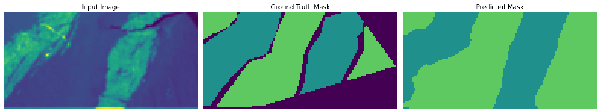
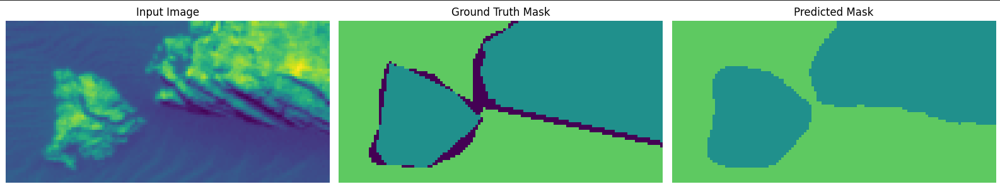

# Artificial Neural Networks and Deep Learning

## Introduction
This is the repository for the Homeworks of Artificial Neural Networks and Deep Learning in the academic year 2024/2025 at Polytechnic of Milan.

Subject: 054307 - Artificial Neural Networks And Deep Learning

Professors: Boracchi Giacomo and Matteucci Matteo

Academic Year: 2024/2025

## Description of the Homeworks
The homeworks includes two different projects involving neural networks and two different tasks:
- First Homework: Image Classification
- Second Homework: Semantic Segmentation

### First Homework
In this assignment, you will classify 96x96 RGB images of blood cells. These images are categorized into eight classes, each representing a particular cell state. This is a multi-class classification problem, so your goal is to assign the correct class label to each RGB image.

<table>
  <tr>
    <td valign="top" align="center">
        <h4>Blood Cells</h4>
      
       
    </td>
  </tr>
</table>

#### Dataset
To enlarge the dataset and to make the proposed neural network robust to changes in the dataset, the technique called **Augmentation** was used.
 <table>
  <tr>
    <td valign="top" align="center">
        <h4>Augmentation 1</h4>
      
       
    </td>
    <td valign="top" align="center">
        <h4>Augmentation 2</h4>
      
       
    </td>
  </tr>
</table>

#### Network Architecture
The implemented network is a **ConvNeXtBase-based transfer learning model** for multi-class image classification, featuring a pretrained backbone with custom fully connected layers to enhance feature representation and regularization.

##### Backbone
**ConvNeXtBase:**
- Pretrained on ImageNet, used as a feature extractor.
- `include_top=False` excludes the original classification head.
- Frozen weights to preserve learned low- and mid-level features.

##### Custom Top Layers
**Global Average Pooling:**
- Reduces spatial dimensions while retaining global feature information.
**Batch Normalization:**
- Stabilizes training and accelerates convergence.
**Dropout Layers:**
- Two stages of dropout (0.2 and 0.25) reduce overfitting.
**Fully Connected (Dense) Layers:**
- Four layers of decreasing size: 512 → 256 → 128 → 64 neurons.
- ReLU activation introduces non-linearity.
- Optional BatchNormalization (commented out) for further stabilization.

##### Output Layer
**Dense Layer with Softmax:**
- Produces class probabilities for `NUM_CLASSES`.

##### Training Configuration
**Loss Function:**
- Categorical cross-entropy with label smoothing (0.1) to improve generalization.
**Optimizer:**
- AdamW with Cosine Decay Restarts for adaptive learning rate scheduling.
**Metrics:**
- Accuracy, Precision, and Recall for comprehensive evaluation.

##### Key Advantages
- **Pretrained ConvNeXtBase backbone:** leverages rich, hierarchical features from ImageNet.
- **Custom top layers:** provide flexibility for different classification tasks.
- **Dropout and BatchNorm:** reduce overfitting and improve training stability.
- **Mixed precision training:** speeds up computation and reduces memory usage.

This combination makes the architecture **robust, efficient, and suitable for high-performance image classification tasks**.  
It was first trained on the dataset as is and next **transfer leanring with fine tuning** was performed by unfreezing the layers of the network.  

#### Results
A validation accuracy of **85.7%** has been obtained after fine tuning. The technique called **Test-Time Augmetation** was also used to improve the performances.    
For further details, check the [report](Homework_1/AN2DL_First_Homework.pdf).  
Some results of the trained networks for comparison:
| Model | Accuracy | Precision | Recall |
| :--- | :--- | :--- | :--- |
| MobileNet | 0.5769 | 0.689 | 0.121 |
| InceptionV3 | 0.658 | 0.7848 | 0.169 |
| EfficientNet | 0.7272 | 0.9765 | 0.253 |
| ConvNeXtBase | 0.857 | 0.9879 | 0.2776 |
| ConvNeXtLarge | 0.8248 | 0.9926 | 0.2643 |

### Second Homework
In this assignment, you will receive 64x128 grayscale real images from Mars terrain. Pixels in these images are categorized into five classes, each representing a particular type of terrain. This is a semantic segmentation problem, so your goal is to assign the correct class label to each mask pixel.  
Pretrained models are **forbidden**.
<table>
  <tr>
    <td valign="top" align="center">
        <h4>Mars Terrain</h4>
      
       
    </td>
    <td valign="top" align="center">
        <h4>Mask</h4>
      
       
    </td>
  </tr>
</table>

#### Dataset
We used **Albumentations augmentation pipeline** to augment the dataset creating a dataset which is the union of smaller datasets created trhough augmentation to increase variability and the number of samples. 

#### Network Architecture

The implemented network is an **enhanced U-Net** for image classification/segmentation, integrating several advanced deep learning modules to improve feature extraction, multi-scale context understanding, and attention.  

##### Encoder (Downsampling Path)  
- **Conv Blocks & ResNet Blocks:**  
  - Four stages of convolutional processing with residual connections.  
  - Each block increases feature depth (32 → 64 → 128 → 256).  
  - Residual shortcuts stabilize training and allow deeper representation learning.  
- **Squeeze-and-Excitation (SE) Block:**  
  - Recalibrates channel-wise feature responses by modeling interdependencies between channels.  
  - Helps the network focus on the most informative features.  

##### Bottleneck  
- **Multi-Scale ASPP:**  
  - Atrous Spatial Pyramid Pooling (ASPP) applied at multiple scales (`filters, filters/2, filters/4`).  
  - Captures both local fine details and global context by combining dilated convolutions with different rates.  
- **Concatenation with skip features:**  
  - Deeper features are fused with intermediate representations (e.g., from `d3` and `d4`) for stronger context.  
- **3×3 Conv Layer:**  
  - Further processing with 512 filters to unify features before decoding.  

##### Decoder (Upsampling Path)  
- **Attention Gates:**  
  - Applied at each skip connection to highlight relevant features and suppress irrelevant background noise.  
  - Gating signals come from ASPP-enhanced encoder outputs.  
- **Conv2DTranspose Layers (Deconvolutions):**  
  - Used for upsampling at each stage (256 → 128 → 64 → 32).  
- **Weighted Fusion:**  
  - Combines skip connections and upsampled features adaptively with learned importance weights.  
- **ResNet Blocks:**  
  - Each upsampling stage includes a residual block to refine features.  

##### Fusion and Output  
- **Fusion Block:**  
  - Upsamples and unifies multi-scale outputs (`u1, u2, u3, u4`) into a single feature representation.  
  - Uses weighted union to balance contributions from different scales.  
- **Output Layer:**  
  - Final **1×1 Conv2D** layer with **Softmax activation** for multi-class classification (5 classes).  

##### Key Innovations  
- **ResNet Blocks:** enable deep feature learning with stable gradients.  
- **Squeeze-and-Excitation:** channel attention mechanism to boost informative filters.  
- **ASPP & Multi-Scale ASPP:** powerful context aggregation at multiple dilation rates.  
- **Attention Gates:** dynamic feature selection at skip connections.  
- **Fusion Block:** combines multi-scale decoder outputs into a unified representation.  

This combination makes the architecture **robust, context-aware, and highly discriminative**, ideal for structured visual tasks.

#### Metrics
We used the **mean IoU (Intersection over Union)** as the metric to evaluate the results.  
**Categorical Crossentropy** is the loss function.
**Weights** are used to weight differently the classes, to take into account under-represented classes.

#### Results

<table>
  <tr>
    <td valign="top" align="center">
        <h4>Mask 1</h4>
      
       
    </td>
  </tr>
</table>

<table>
  <tr>
    <td valign="top" align="center">
        <h4>Mask 2</h4>
      
       
    </td>
  </tr>
</table>

The **final validation mean_IoU** is **72.95%**.  
We used also **Test-Time Augmentation** to improve the final result.  
For further details, check the [report](Homework_2/AN2DL_Second_Homework.pdf).  
Some results for different loss functions:
| Loss Function | mean IoU | Accuracy |
| :--- | :--- | :--- |
| Dice Loss | 0.6467 | 0.653 |
| Tversky Loss | 0.6555 | 0.6354 |
| Focal Loss | 0.682 | 0.674 |
| Categorical Cross-entropy | 0.7295 | 0.6959 |

## Final Considerations
First Homework Final Position: 
- Private Leaderboard (Final phase): Top 20 over 700+ people
   
Second Homework Final Position:
- Public Leaderboard (Intermediate position): 63/197 (197 groups in total)
- Private Leaderboard (Final Position): 9/197

## Authors
This Project was developed by:
- Corradina Davide [@CorraPiano](https://github.com/CorraPiano)
- De Introna Federico [@federicodeintrona](https://github.com/federicodeintrona)
- Di Giore Francesco [@Digioref](https://github.com/Digioref)
