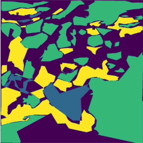

# Artificial Neural Networks and Deep Learning

## Authors
This Project was developed by:
- Corradina Davide [@CorraPiano](https://github.com/CorraPiano)
- De Introna Federico [@federicodeintrona](https://github.com/federicodeintrona)
- Di Giore Francesco [@Digioref](https://github.com/Digioref)

## Introduction
This is the repository for the Homeworks of Artificial Neural Networks and Deep Learning in the academic year 2024/2025 at Polytechnic of Milan.

Subject: 054307 - Artificial Neural Networks And Deep Learning

Professors: Boracchi Giacomo and Matteucci Matteo

Academic Year: 2024/2025

## Description of the Homeworks
The homeworks includes two different projects involving neural networks and two different tasks:
- First Homework: Image Classification
- Second Homework: Semantic Segmentation

### First Homework
In this assignment, you will classify 96x96 RGB images of blood cells. These images are categorized into eight classes, each representing a particular cell state. This is a multi-class classification problem, so your goal is to assign the correct class label to each RGB image.

<table>
  <tr>
    <td valign="top" align="center">
        <h4>Blood Cells</h4>
      
       
    </td>
  </tr>
</table>

To enlarge the dataset and to make the proposed neural network robust to changes in the dataset, the technique called **Augmentation** was used.
 <table>
  <tr>
    <td valign="top" align="center">
        <h4>Augmentation 1</h4>
      
       
    </td>
    <td valign="top" align="center">
        <h4>Augmentation 2</h4>
      
       
    </td>
  </tr>
</table>

Then, we used the neural network called **ConvNeXtBase** which has 89M of parameters. It was modified by adding 4 more *dense* layers for classifications. It was first trained on the dataset as is and next **transfer leanring with fine tuning** was performed by unfreezing the layers of the network.  
A validation accuracy of **85.7%** has been obtained after fine tuning. The technique called **Test-Time Augmetation** was also used to improve the performances.    
For further details, check the [report](Homework_1/AN2DL_First_Homework.pdf).

### Second Homework
In this assignment, you will receive 64x128 grayscale real images from Mars terrain. Pixels in these images are categorized into five classes, each representing a particular type of terrain. This is a semantic segmentation problem, so your goal is to assign the correct class label to each mask pixel.  
Pretrained models are **forbidden**.
<table>
  <tr>
    <td valign="top" align="center">
        <h4>Mars Terrain</h4>
      
       
    </td>
    <td valign="top" align="center">
        <h4>Mask</h4>
      
       
    </td>
  </tr>
</table>

